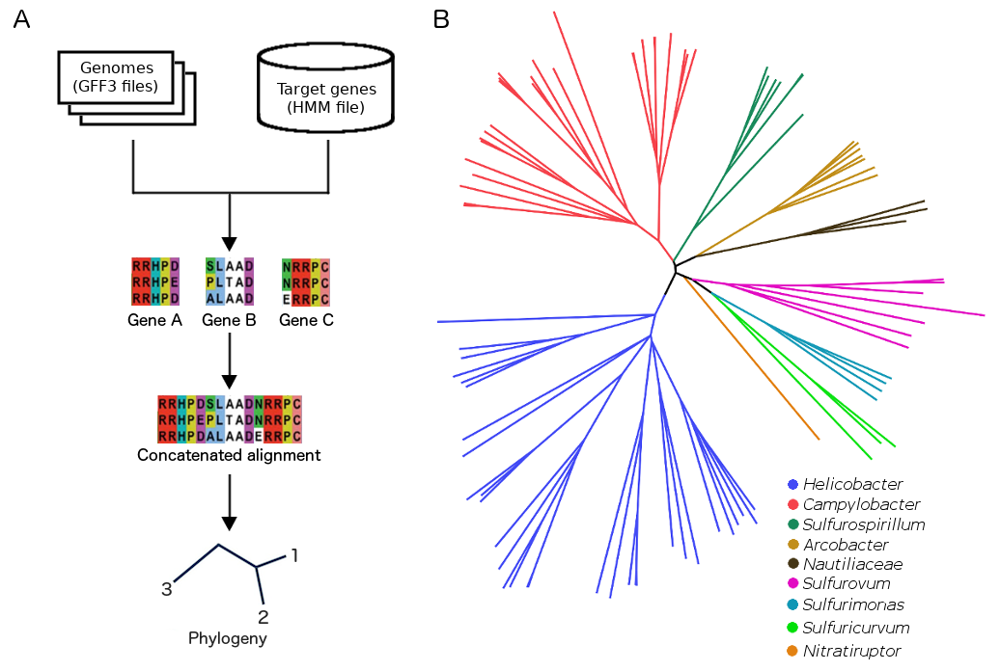

# Summary

High-throughput sequencing is dramatically increasing the amount of genetic data available from all domains of life, but particularly from bacteria. The smaller size of bacterial genomes allows to sequence large collections of strains, mainly from species that deserve interest for their importance as human or farm animal pathogens. Phylogenetic analysis has become a standard tool to understand the evolutionary history, epidemiology and virulence of these bacteria, and the availability of genomic information has allowed to move from single-gene (e.g. using the 16S rRNA gene) to multilocus or core genome trees that bring us closer to a more reliable reconstruction of phylogenetic structure. 

The EggNOG database [@eggnog] is an excellent resource providing orthologous groups shared at different taxonomic ranks including several prokaryotes. Here we present Phylen, a simple and automated software package written in R that reconstructs phylogenies by interacting with the EggNOG database. First, a set of orthologous groups available at the EggNOG database is selected and automatically downloaded or, alternatively, an external set of orthologous groups can be provided formatted as a Hidden Markov Model (HMM) file. Second, genome annotations in GFF3 format (such as those from Prokka annotation software [@prokka]) are parsed to extract translated coding sequences. Third, genomes are screened against these orthologous groups using HMMER3 [@hmmer3]. Forth, "core" coding sequences are extracted and multiple sequence alignment is performed over each recovered gene set using MAFFT [@mafft]. Fifth, alignments are concatenated into a single supergene and phylogenetic reconstruction is performed using Maximum-Likelihood or distance methods (Fig. 1A). Phylen outputs one multi-fasta alignment per gene, one supergene multi-fasta alignment file, one tree file in Newick format and an object of class "phylo" which can be further analysed using the R packeges ape [@ape] and phangorn [@phangorn].

Phylen has been already used by our group for building the _Helicobacter_ genus phylogeny [@valdiviensis] from a set of 40 universal marker genes [@fetchmg], and to reconstruct core genome phylogenies of _Leptospira_ genus [@venezuelensis; @caledonia] from orthologous groups defined in the EggNOG database (spiNOG) [@eggnog]. Additionaly, here we screened 93 _Epsilonproteobacteria_ genomes against 4513 orthologous groups from the EggNOG database (eproNOG) to obtain the phylogenetic tree shown in Fig. 1B. In the near future we plan to add more functionalities such as different multiple sequence alignment algorithms and tools for alignment quality check and trimming.
\pagebreak

Phylen has been designed to facilitate the reconstruction of high-resolution phylogenies at any desired taxonomic rank, and from any set of genes like taxon-specific markers or the whole core genome. Phylogenetic reconstruction is a standard kick-off  analysis in almost every comparative genomics project and despite many methods have been developed, Phylen is unique as integrates the highly accessed EggNOG database (for phylogenetic marker genes) with the R environment as a widely used programming interface for microbial genomics and data analysis. Phylen depends on the R package phangorn [@phangorn] for phylogenetic reconstruction and external tools including HMMER3 [@hmmer3] as gene search engine and MAFFT [@mafft] for multiple sequence alignment.

# Acknowledgements

I.F. was supported by ANII (Uruguay) posgraduation grant POS_NAC_2016_1_131079. We thank Pablo Fresia and Daniela Costa for testing Phylen. 

# References
